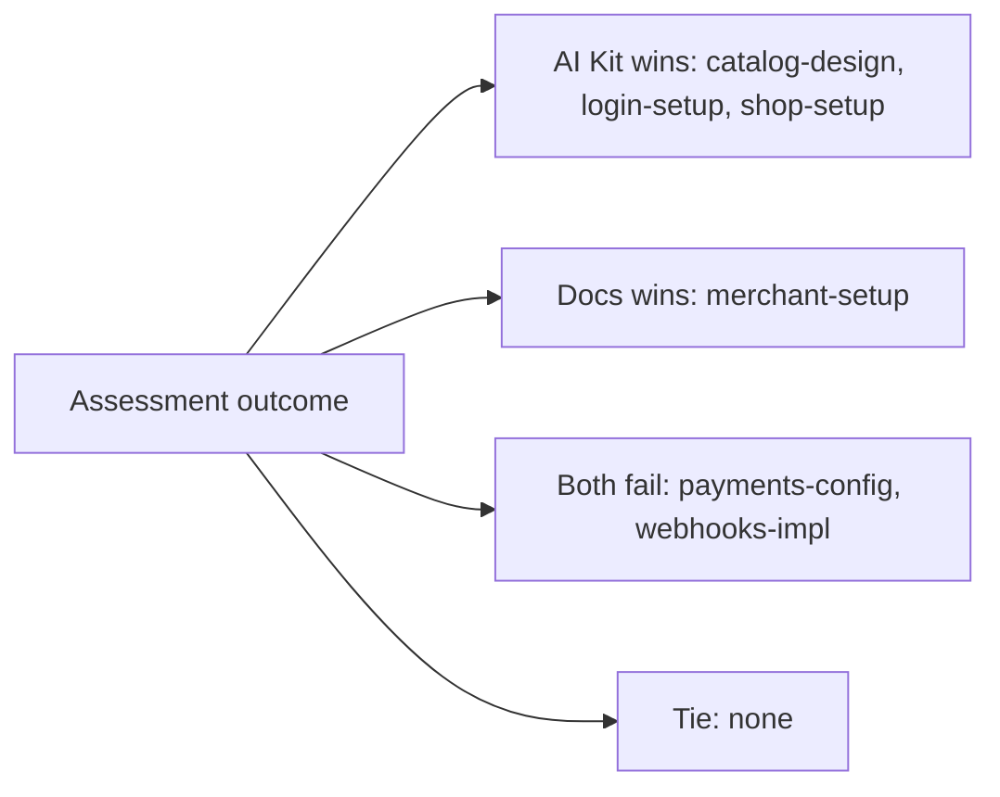

# Xsolla AI Kit Skill Evaluation

## TL;DR

We evaluated 6 `xsolla-ai-kit` skills using the current harness algorithm.

- **AI Kit**: task prompt + `SKILL.md` + skill references.
- **Official docs**: task prompt + curated `developers.xsolla.com` corpus.
Each skill was run `k=3` times for the AI Kit and official-docs variants, then judged by an Anthropic LLM judge against the same rubric. A no-context control was also run to verify that raw model knowledge alone is not enough for safe Xsolla integration work.

Main result:

- **AI Kit**: `10/18` pass = **55.6%**
- **Official docs**: `8/18` pass = **44.4%**
Interpretation: AI Kit outperforms official docs overall, but the result is uneven. It is strong for `catalog-design`, `login-setup`, and `shop-setup`; official docs still win for `merchant-setup`; `payments-config` and `webhooks-impl` need product-quality remediation before they can be trusted.

Generated: `2026-06-30 15:00 UTC`

## Methodology

### Run Matrix

- Skills: `catalog-design, login-setup, merchant-setup, payments-config, shop-setup, webhooks-impl`
- Variants: `ai_kit`, `docs`, `no_context`
- Repetitions: `k=3`
- Total scored runs: `54`
- Evidence level: agent transcript + LLM judge
- Reliability: `scored`

### Variants

| Variant | Context Given to Agent | Purpose |
|---|---|---|
| AI Kit | User task + `SKILL.md` + references | Measures skill value |
| Official docs | User task + official `developers.xsolla.com` docs corpus | Fair documentation baseline |
| No context | User task only | Control group used only to validate that context is necessary |

### Metrics

| Metric | Meaning |
|---|---|
| Success rate | Share of runs with judge pass rate >= rubric threshold and safety checks passing |
| Distribution | Per-run pass/fail over `k=3`, e.g. `111`, `010`, `000` |
| First try | Whether run 1 passed |
| pass@k | Whether at least one of the `k` runs passed |
| Confidence | Average judge pass rate before thresholding |
| Safety errors | Count of failed safety checks |
| Contract errors | Count of failed contract/programmatic checks |
| Tokens | Approximate tokens in prompt + answer transcript |

## Overall Results

| Variant | Pass | Success Rate | Avg Confidence | Safety Errors | Contract Errors | Avg Tokens |
|---|---:|---:|---:|---:|---:|---:|
| AI Kit | 10/18 | 55.6% | 85.9% | 6 | 0 | 2203 |
| Official docs | 8/18 | 44.4% | 82.9% | 6 | 0 | 2097 |

Control check: the no-context baseline scored `0/18` pass = **0%**. This confirms that the benchmark is measuring context quality, not only generic model capability.

## Skill Comparison

This table keeps the benchmark focused on **AI Kit vs Official docs**. The no-context baseline is intentionally excluded from the winner calculation.

| Skill | AI Kit | Official Docs | Winner | AI Kit Safety | Docs Safety | Notes |
|---|---:|---:|---|---:|---:|---|
| catalog-design | 100% `111` | 66.7% `011` | AI Kit | 0 | 0 | - |
| login-setup | 100% `111` | 33.3% `010` | AI Kit | 0 | 0 | - |
| merchant-setup | 33.3% `010` | 100% `111` | Official docs | 2 | 0 | AI Kit safety risk |
| payments-config | 0% `000` | 0% `000` | Tie | 3 | 3 | both fail, AI Kit safety risk, docs safety risk, skill is placeholder/planned |
| shop-setup | 100% `111` | 66.7% `110` | AI Kit | 0 | 1 | docs safety risk |
| webhooks-impl | 0% `000` | 0% `000` | Tie | 1 | 2 | both fail, AI Kit safety risk, docs safety risk |

## Graphs

### Success Rate

```mermaid
xychart-beta
    title "Success Rate by Skill: AI Kit vs Official Docs"
    x-axis ["catalog", "login", "merchant", "payments", "shop", "webhooks"]
    y-axis "Success rate (%)" 0 --> 100
    bar [100, 100, 33.3, 0, 100, 0]
    bar [66.7, 33.3, 100, 0, 66.7, 0]
```



### Safety Errors

```mermaid
xychart-beta
    title "Safety Errors by Skill: AI Kit vs Official Docs"
    x-axis ["catalog", "login", "merchant", "payments", "shop", "webhooks"]
    y-axis "Safety errors" 0 --> 3
    bar [0, 0, 2, 3, 0, 1]
    bar [0, 0, 0, 3, 1, 2]
```



### Outcome Map



## Key Findings

1. `catalog-design`, `login-setup`, and `shop-setup` passed all AI Kit runs (`3/3`) and beat the official docs baseline.
2. `merchant-setup` performed better with official docs (`3/3`) than with AI Kit (`1/3`), indicating the skill needs tightening around credential safety and setup flow.
3. `payments-config` failed across all variants. This is expected risk because the skill is still placeholder/planned.
4. `webhooks-impl` failed across all variants. The AI Kit skill has useful content but did not reach the strict rubric threshold, so it needs rubric-aligned rewrite or deeper handler examples.
5. The no-context control failed every run (`0/18`), so context quality is the core variable in this assessment rather than generic model capability.

## Files

- `data/dashboard-data.json` — machine-readable scored results.
- `data/ai-kit-eval-report.md` — raw harness report.
- `scripts/generate_readme.py` — regenerates this README from `data/dashboard-data.json`.

## Re-generate README

```bash
python3 scripts/generate_readme.py
```
