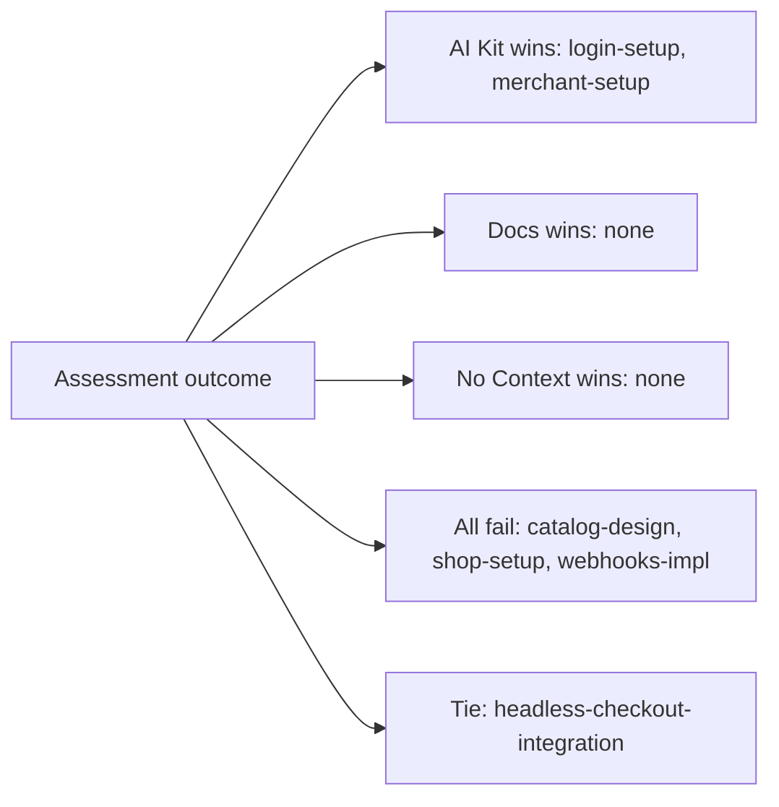

# Xsolla AI Kit Skill Evaluation

## TL;DR

We evaluated 6 `xsolla-ai-kit` skills using the current harness algorithm.

- **AI Kit**: task prompt + `SKILL.md` + skill references.
- **Official docs**: task prompt + curated `developers.xsolla.com` corpus.
- **No Context**: task prompt only.

Each skill was run `k=3` times per variant, then judged by an Anthropic LLM judge against the same rubric.

Main result:

- **AI Kit**: `7/18` pass = **38.9%**
- **Official docs**: `3/18` pass = **16.7%**
- **No Context**: `0/18` pass = **0%**

Interpretation: AI Kit outperforms official docs overall, but production-ready value is concentrated in `headless-checkout-integration`. `login-setup` and `merchant-setup` are partial wins, while `catalog-design`, `shop-setup`, and `webhooks-impl` need product-quality remediation before they can be trusted.

Generated: `2026-07-06 07:48 UTC`

## Methodology

### Run Matrix

- Skills: `catalog-design, login-setup, merchant-setup, headless-checkout-integration, shop-setup, webhooks-impl`
- Variants: `ai_kit`, `docs`, `no_context`
- Repetitions: `k=3`
- Total scored runs: `54`
- Evidence level: agent transcript + LLM judge
- Reliability: `scored`

### Model Input Data

| Input | Value |
|---|---|
| Provider | Anthropic Messages API |
| Endpoint | `https://api.anthropic.com/v1/messages` |
| Anthropic version header | `2023-06-01` |
| Agent model | `claude-sonnet-4-6` |
| Judge model | `claude-sonnet-5` |
| Agent `max_tokens` | `4096` standard eval; `16000` for Headless Checkout artifact eval |
| Judge `max_tokens` | `4096` standard eval; `6000` for Headless Checkout artifact eval |
| Agent temperature | `0.2` |
| Judge temperature | Not sent for `claude-sonnet-5` because Anthropic rejects deprecated temperature for this model |
| Agent input per run | System instruction + task prompt + variant-specific context |
| Judge input per run | Transcript + rubric checks + safety checks |

### Variants

| Variant | Context Given to Agent | Purpose |
|---|---|---|
| AI Kit | User task + `SKILL.md` + references | Measures skill value |
| Official docs | User task + official `developers.xsolla.com` docs corpus | Fair documentation baseline |
| No Context | User task only | Baseline for model behavior without skill or documentation context |

### Metrics

| Metric | Meaning |
|---|---|
| Success rate | How many runs passed the rubric and safety checks. This is the main quality signal. |
| Distribution | Shows pass/fail for each of the 3 runs, like `111`, `010`, or `000`. It shows stability, not just the average. |
| First try | Shows whether the first run passed. It matters because users usually expect the first answer to work. |
| pass@k | Shows whether at least one of the 3 runs passed. It shows whether retries can recover a weak first answer. |
| Confidence | Average judge score before applying the pass threshold. It helps distinguish near-misses from bad answers. |
| Safety errors | Count of failed safety checks, such as exposing secrets or unsafe integration advice. Any safety error is a launch blocker. |
| Contract errors | Count of failed API/schema checks. These catch wrong endpoints, wrong field types, and doc-vs-live mismatches. |
| Tokens | Approximate size of the prompt plus answer. Lower token use is better only when quality stays high. |

## Overall Results

| Variant | Pass | Success Rate | Avg Confidence | Safety Errors | Contract Errors | Avg Tokens |
|---|---:|---:|---:|---:|---:|---:|
| AI Kit | 7/18 | 38.9% | 74.9% | 6 | 0 | 3273 |
| Official docs | 3/18 | 16.7% | 66.9% | 5 | 0 | 3137 |
| No context | 0/18 | 0% | 31.4% | 10 | 1 | 2576 |

## Skill Comparison

This table compares all three variants using the same benchmark. The winner is selected from the AI Kit, the official documentation and the 'No Context' strategy, as these are the three most suitable for production work.

| Skill | AI Kit | Official Docs | No Context | Winner | AI Kit Safety | Docs Safety | No Context Safety | Notes |
|---|---:|---:|---:|---|---:|---:|---:|---|
| catalog-design | 0% `000` | 0% `000` | 0% `000` | Tie | 0 | 0 | 0 | both fail |
| login-setup | 66.7% `011` | 0% `000` | 0% `000` | AI Kit | 1 | 0 | 1 | AI Kit safety risk |
| merchant-setup | 66.7% `101` | 0% `000` | 0% `000` | AI Kit | 1 | 0 | 0 | AI Kit safety risk |
| headless-checkout-integration | 100% `111` | 100% `111` | 0% `000` | Tie | 0 | 0 | 3 | artifact-based eval |
| shop-setup | 0% `000` | 0% `000` | 0% `000` | Tie | 2 | 3 | 3 | both fail, AI Kit safety risk, docs safety risk |
| webhooks-impl | 0% `000` | 0% `000` | 0% `000` | Tie | 2 | 2 | 3 | both fail, AI Kit safety risk, docs safety risk |

## Skills

Each chart below is centered on one skill. The x-axis shows the metrics for that skill, and the three bars compare AI Kit, official docs, and No Context.

All values are normalized to a 0–100 scale where higher is better. The chart is outcome-gated: if a variant has `0%` success for a skill, its diagnostic metrics are shown as `0` because a safe-looking but unusable answer does not create business value.

Legend:

1. 🟩 AI Kit
2. 🟦 Official docs
3. 🟥 No Context

### catalog-design

**Description:** We asked the agent to configure a game catalog with virtual currency, items, bundles, regional pricing, storefront reads, and purchase confirmation. A good answer had to separate Admin API setup from client catalog usage and avoid known pricing/schema mistakes.

> No variant passed this skill. The chart is outcome-gated, so all business metrics are shown as `0`.

| Variant | Success | Confidence | Safety Errors | Contract Errors |
|---|---:|---:|---:|---:|
| AI Kit | 0% | 80% | 0 | 0 |
| Official docs | 0% | 62.7% | 0 | 0 |
| No Context | 0% | 44.7% | 0 | 0 |

### login-setup

**Description:** We asked the agent to design a web Login integration with Google, email/password, passwordless email, and backend JWT validation. A good answer had to use the right OAuth/Login flows and verify JWTs safely.

```mermaid
xychart-beta
    title "login-setup: metrics by variant"
    x-axis ["Success", "First try", "pass@k", "Confidence", "Safety", "Contract", "Token efficiency"]
    y-axis "Normalized score, higher is better" 0 --> 100
    bar [66.7, 0, 100, 86.7, 66.7, 100, 73.3]
    bar [0, 0, 0, 0, 0, 0, 0]
    bar [0, 0, 0, 0, 0, 0, 0]
```



### merchant-setup

**Description:** We asked the agent to guide a new sandbox merchant/project setup and credential storage. A good answer had to protect API keys, use the correct project-level credentials, and avoid pretending the agent can create the account itself.

```mermaid
xychart-beta
    title "merchant-setup: metrics by variant"
    x-axis ["Success", "First try", "pass@k", "Confidence", "Safety", "Contract", "Token efficiency"]
    y-axis "Normalized score, higher is better" 0 --> 100
    bar [66.7, 100, 100, 94.3, 66.7, 100, 90.4]
    bar [0, 0, 0, 0, 0, 0, 0]
    bar [0, 0, 0, 0, 0, 0, 0]
```



### headless-checkout-integration

**Description:** We asked the agent to generate a runnable sandbox Headless Checkout implementation. A good answer had to create real files with SDK setup, safe token handoff, card form flow, return/status handling, and sandbox card validation.

*For headless-checkout-integration, the payment skill was tested with the stronger artifact-based flow: the agent had to generate runnable project files and pass automated code checks in addition to the LLM judge.*

```mermaid
xychart-beta
    title "headless-checkout-integration: metrics by variant"
    x-axis ["Success", "First try", "pass@k", "Confidence", "Safety", "Contract", "Token efficiency"]
    y-axis "Normalized score, higher is better" 0 --> 100
    bar [100, 100, 100, 100, 100, 100, 0]
    bar [100, 100, 100, 97, 100, 100, 8.7]
    bar [0, 0, 0, 0, 0, 0, 0]
```



### shop-setup

**Description:** We asked the agent to plan a full headless shop from catalog browsing to checkout and fulfillment. A good answer had to connect catalog, cart, Login, payment token, payment UI, webhooks, and production readiness in the right order.

> No variant passed this skill. The chart is outcome-gated, so all business metrics are shown as `0`.

| Variant | Success | Confidence | Safety Errors | Contract Errors |
|---|---:|---:|---:|---:|
| AI Kit | 0% | 46.7% | 2 | 0 |
| Official docs | 0% | 47.7% | 3 | 0 |
| No Context | 0% | 25.5% | 3 | 0 |

### webhooks-impl

**Description:** We asked the agent to implement a backend webhook handler for granting items after purchase. A good answer had to verify signatures, handle retries and idempotency, process required events, and avoid double grants.

> No variant passed this skill. The chart is outcome-gated, so all business metrics are shown as `0`.

| Variant | Success | Confidence | Safety Errors | Contract Errors |
|---|---:|---:|---:|---:|
| AI Kit | 0% | 41.7% | 2 | 0 |
| Official docs | 0% | 45.8% | 2 | 0 |
| No Context | 0% | 34.5% | 3 | 0 |

### Outcome Map

Measurement: winner by skill across AI Kit, official docs, and No Context success rate. All-fail means every variant scored 0%.



## Key Findings

1. `headless-checkout-integration` is the strongest result: AI Kit and official docs both passed all artifact-based runs (`3/3`), while no-context failed (`0/3`).
2. `login-setup` and `merchant-setup` are partial AI Kit wins (`2/3` each), but both still show safety risk and need tighter step-by-step guardrails.
3. `catalog-design`, `shop-setup`, and `webhooks-impl` failed across all variants, so these skills need rubric-aligned rewrites or deeper production examples.
4. Official docs only produced a passing outcome for `headless-checkout-integration`; docs alone were not enough for the other tested workflows.
5. The no-context control failed every run (`0/18`), so context quality is the core variable in this assessment rather than generic model capability.

## Files

- `data/dashboard-data.json` — machine-readable scored results.
- `data/ai-kit-eval-report.md` — raw harness report.
- `scripts/generate_readme.py` — regenerates this README from `data/dashboard-data.json`.

## Re-generate README

```bash
python3 scripts/generate_readme.py
```
