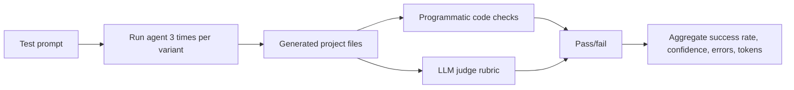
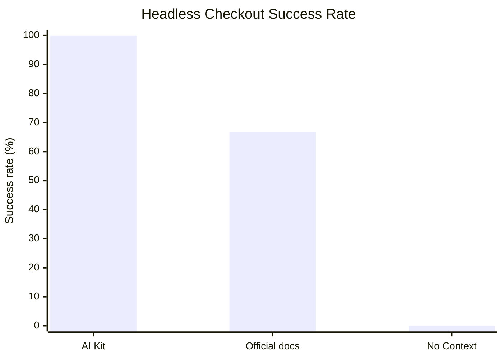
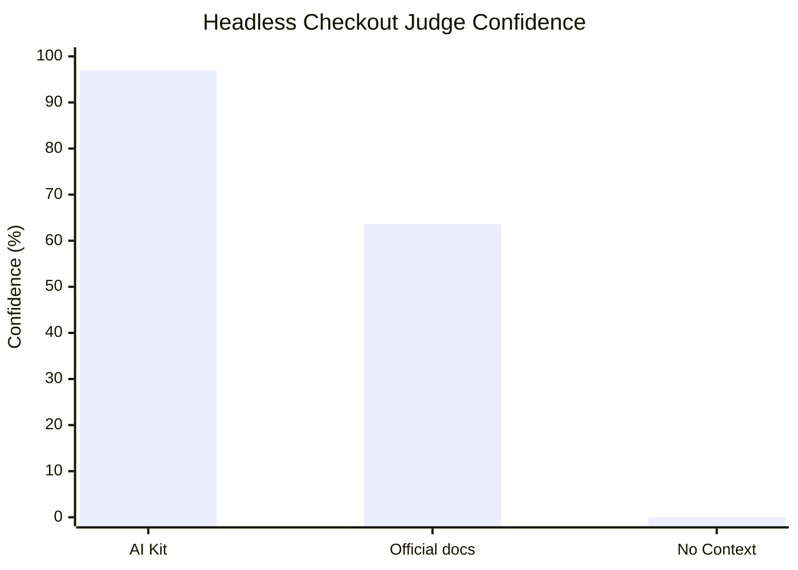
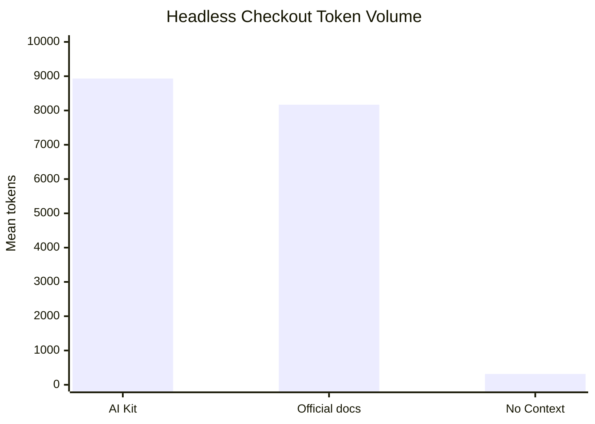

# Headless Checkout Skill Evaluation

## TL;DR

We tested the current `headless-checkout-integration` skill from the latest `xsolla-ai-kit` repository.
The expected result was a runnable sandbox Headless Checkout implementation, not just a written explanation.

Main result:

- **AI Kit**: `3/3` pass = **100%**
- **Official docs**: `2/3` pass = **66.7%**
- **No Context**: `0/3` pass = **0%**

Conclusion: AI Kit produced the strongest result for this use case. It generated complete runnable artifacts more reliably than official docs or no-context prompting.

Generated: `2026-07-01 19:08 UTC`

## What We Tested

Use case: **integrate Xsolla Headless Checkout into a web app and complete a sandbox credit-card payment flow**.

Expected implementation:

- install and initialize `@xsolla/pay-station-sdk` with `sandbox: true`;
- safely get and hand off a short-lived payment token;
- render payment method selection;
- build the card form from server-driven `form.fields`;
- call `form.activate()` after secure fields are mounted;
- handle `onNextAction` branches: `show_fields`, `show_errors`, `redirect`, `3DS`, and `check_status`;
- implement a return/status page using `psdk-status` or `getStatus()`;
- include validation for three sandbox card paths:
  - `4111111111111111` — no 3DS;
  - `4111111111111152` — 3DS via acquirer redirect;
  - `4423610000000007` — 3DS via external MPI.

## How We Tested

We ran the same task in three variants:

| Variant | Input Context |
|---|---|
| AI Kit | Task prompt + `headless-checkout-integration/SKILL.md` + references |
| Official docs | Task prompt + official Xsolla Headless Checkout documentation |
| No Context | Task prompt only |

Each variant ran `k=3` times. Every run had to generate real project files, then pass both automated code checks and an LLM judge.

## Evaluation Algorithm



## Metrics

| Metric | Meaning |
|---|---|
| Success rate | How many runs passed both the code checks and judge rubric. This is the main quality signal. |
| Distribution | Shows pass/fail for each of the 3 runs, like `111` or `110`. It shows stability, not just the average. |
| Judge confidence | Average judge score before thresholding. It shows how close failed runs were to passing. |
| Safety errors | Count of failed safety checks, such as exposing API keys. Any safety error is a launch risk. |
| Contract errors | Count of failed required artifact/code checks. These show missing implementation pieces. |
| Avg tokens | Approximate size of prompt plus answer. Lower is better only when quality remains high. |

## Results

| Variant | Pass | Success Rate | Distribution | Judge Confidence | Safety Errors | Contract Errors | Avg Tokens |
|---|---:|---:|---|---:|---:|---:|---:|
| AI Kit | 3/3 | 100% | `111` | 97% | 0 | 0 | 8931.3 |
| Official docs | 2/3 | 66.7% | `110` | 63.6% | 0 | 0 | 8169.3 |
| No Context | 0/3 | 0% | `000` | 0% | 0 | 0 | 317 |

## Visual Summary

Legend:

1. 🟩 AI Kit
2. 🟦 Official docs
3. 🟥 No Context

### Success Rate

Measurement: percent of runs that passed the full artifact-based evaluation.



### Judge Confidence

Measurement: average judge pass rate before thresholding.



### Token Volume

Measurement: approximate mean tokens in prompt plus answer transcript.



## What We Got

AI Kit passed all three runs. The official docs baseline passed two out of three runs. The no-context baseline passed zero runs.

This means the new skill materially improves the agent's ability to produce a complete sandbox Headless Checkout implementation, especially when the eval checks generated files instead of only prose.

## Files

- `data/dashboard-data.json` — machine-readable scored result.
- `data/ai-kit-eval-report.md` — raw harness report.
- `scripts/generate_readme.py` — regenerates this README from `data/dashboard-data.json`.

## Regenerate

```bash
python3 scripts/generate_readme.py
```
