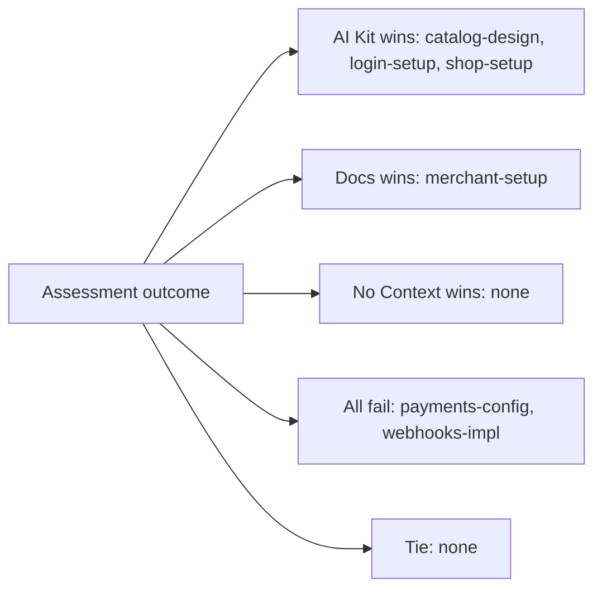

# Xsolla AI Kit Skill Evaluation

## TL;DR

We evaluated 6 `xsolla-ai-kit` skills using the current harness algorithm.

- **AI Kit**: task prompt + `SKILL.md` + skill references.
- **Official docs**: task prompt + curated `developers.xsolla.com` corpus.
- **No Context**: task prompt only.

Each skill was run `k=3` times per variant, then judged by an Anthropic LLM judge against the same rubric.

Main result:

- **AI Kit**: `10/18` pass = **55.6%**
- **Official docs**: `8/18` pass = **44.4%**
- **No Context**: `0/18` pass = **0%**

Interpretation: AI Kit outperforms official docs overall, but the result is uneven. It is strong for `catalog-design`, `login-setup`, and `shop-setup`; official docs still win for `merchant-setup`; `payments-config` and `webhooks-impl` need product-quality remediation before they can be trusted.

Generated: `2026-06-30 15:48 UTC`

## Methodology

### Run Matrix

- Skills: `catalog-design, login-setup, merchant-setup, payments-config, shop-setup, webhooks-impl`
- Variants: `ai_kit`, `docs`, `no_context`
- Repetitions: `k=3`
- Total scored runs: `54`
- Evidence level: agent transcript + LLM judge
- Reliability: `scored`

### Variants

| Variant | Context Given to Agent | Purpose |
|---|---|---|
| AI Kit | User task + `SKILL.md` + references | Measures skill value |
| Official docs | User task + official `developers.xsolla.com` docs corpus | Fair documentation baseline |
| No Context | User task only | Baseline for model behavior without skill or documentation context |

### Metrics

| Metric | Meaning |
|---|---|
| Success rate | How many runs passed the rubric and safety checks. This is the main quality signal. |
| Distribution | Shows pass/fail for each of the 3 runs, like `111`, `010`, or `000`. It shows stability, not just the average. |
| First try | Shows whether the first run passed. It matters because users usually expect the first answer to work. |
| pass@k | Shows whether at least one of the 3 runs passed. It shows whether retries can recover a weak first answer. |
| Confidence | Average judge score before applying the pass threshold. It helps distinguish near-misses from bad answers. |
| Safety errors | Count of failed safety checks, such as exposing secrets or unsafe integration advice. Any safety error is a launch blocker. |
| Contract errors | Count of failed API/schema checks. These catch wrong endpoints, wrong field types, and doc-vs-live mismatches. |
| Tokens | Approximate size of the prompt plus answer. Lower token use is better only when quality stays high. |

## Overall Results

| Variant | Pass | Success Rate | Avg Confidence | Safety Errors | Contract Errors | Avg Tokens |
|---|---:|---:|---:|---:|---:|---:|
| AI Kit | 10/18 | 55.6% | 85.9% | 6 | 0 | 2203 |
| Official docs | 8/18 | 44.4% | 82.9% | 6 | 0 | 2097 |
| No context | 0/18 | 0% | 60.1% | 6 | 1 | 1941 |

## Skill Comparison

This table compares all three variants on the same benchmark. Winner is selected between AI Kit and official docs because those are the two usable context strategies for production work.

| Skill | AI Kit | Official Docs | No Context | Winner | AI Kit Safety | Docs Safety | No Context Safety | Notes |
|---|---:|---:|---:|---|---:|---:|---:|---|
| catalog-design | 100% `111` | 66.7% `011` | 0% `000` | AI Kit | 0 | 0 | 0 | - |
| login-setup | 100% `111` | 33.3% `010` | 0% `000` | AI Kit | 0 | 0 | 1 | - |
| merchant-setup | 33.3% `010` | 100% `111` | 0% `000` | Official docs | 2 | 0 | 0 | AI Kit safety risk |
| payments-config | 0% `000` | 0% `000` | 0% `000` | Tie | 3 | 3 | 3 | both fail, AI Kit safety risk, docs safety risk, skill is placeholder/planned |
| shop-setup | 100% `111` | 66.7% `110` | 0% `000` | AI Kit | 0 | 1 | 1 | docs safety risk |
| webhooks-impl | 0% `000` | 0% `000` | 0% `000` | Tie | 1 | 2 | 1 | both fail, AI Kit safety risk, docs safety risk |

## Graphs

### Success Rate

Measurement: percent of runs that passed the rubric threshold (`pass_rate >= 95`) and all safety checks.

Legend:

1. 🟩 AI Kit
2. 🟦 Official docs
3. 🟥 No Context



```mermaid
xychart-beta
    title "Success Rate by Skill"
    x-axis ["catalog", "login", "merchant", "payments", "shop", "webhooks"]
    y-axis "Success rate (%)" 0 --> 100
    bar [100, 100, 33.3, 0, 100, 0]
    bar [66.7, 33.3, 100, 0, 66.7, 0]
    bar [0, 0, 0, 0, 0, 0]
```

### First-Try Success

Measurement: whether the first run for each skill and variant passed, expressed as 0% or 100%.

Legend:

1. 🟩 AI Kit
2. 🟦 Official docs
3. 🟥 No Context



```mermaid
xychart-beta
    title "First-Try Success by Skill"
    x-axis ["catalog", "login", "merchant", "payments", "shop", "webhooks"]
    y-axis "First-try success (%)" 0 --> 100
    bar [100, 100, 0, 0, 100, 0]
    bar [0, 0, 100, 0, 100, 0]
    bar [0, 0, 0, 0, 0, 0]
```

### pass@k

Measurement: whether at least one of the `k=3` runs passed for each skill and variant.

Legend:

1. 🟩 AI Kit
2. 🟦 Official docs
3. 🟥 No Context



```mermaid
xychart-beta
    title "pass@k by Skill"
    x-axis ["catalog", "login", "merchant", "payments", "shop", "webhooks"]
    y-axis "pass@k (%)" 0 --> 100
    bar [100, 100, 100, 0, 100, 0]
    bar [100, 100, 100, 0, 100, 0]
    bar [0, 0, 0, 0, 0, 0]
```

### Judge Confidence

Measurement: average judge pass rate before thresholding, by skill and variant.

Legend:

1. 🟩 AI Kit
2. 🟦 Official docs
3. 🟥 No Context



```mermaid
xychart-beta
    title "Average Judge Confidence by Skill"
    x-axis ["catalog", "login", "merchant", "payments", "shop", "webhooks"]
    y-axis "Confidence (%)" 0 --> 100
    bar [100.0, 100.0, 83.3, 50.0, 100.0, 82.3]
    bar [93.3, 84.0, 100.0, 58.3, 93.3, 68.3]
    bar [73.3, 64.0, 70.0, 50.0, 40.0, 63.0]
```

### Safety Errors

Measurement: count of failed safety checks across `k=3` runs for each skill and variant.

Legend:

1. 🟩 AI Kit
2. 🟦 Official docs
3. 🟥 No Context



```mermaid
xychart-beta
    title "Safety Errors by Skill"
    x-axis ["catalog", "login", "merchant", "payments", "shop", "webhooks"]
    y-axis "Safety errors" 0 --> 3
    bar [0, 0, 2, 3, 0, 1]
    bar [0, 0, 0, 3, 1, 2]
    bar [0, 1, 0, 3, 1, 1]
```

### Contract Errors

Measurement: count of failed contract/programmatic checks across `k=3` runs for each skill and variant.

Legend:

1. 🟩 AI Kit
2. 🟦 Official docs
3. 🟥 No Context



```mermaid
xychart-beta
    title "Contract Errors by Skill"
    x-axis ["catalog", "login", "merchant", "payments", "shop", "webhooks"]
    y-axis "Contract errors" 0 --> 3
    bar [0, 0, 0, 0, 0, 0]
    bar [0, 0, 0, 0, 0, 0]
    bar [0, 0, 0, 0, 1, 0]
```

### Token Volume

Measurement: approximate mean tokens in prompt plus answer transcript, by skill and variant.

Legend:

1. 🟩 AI Kit
2. 🟦 Official docs
3. 🟥 No Context



```mermaid
xychart-beta
    title "Mean Tokens by Skill"
    x-axis ["catalog", "login", "merchant", "payments", "shop", "webhooks"]
    y-axis "Mean tokens" 0 --> 3000
    bar [2355, 2461.7, 819.7, 2356, 2711.7, 2516]
    bar [2241.7, 2348.7, 1231.3, 1917, 2337.7, 2505.7]
    bar [2247.3, 2255.3, 1157.7, 2106.3, 1573.3, 2304.7]
```

### Outcome Map

Measurement: winner by skill across AI Kit, official docs, and No Context success rate. All-fail means every variant scored 0%.



## Key Findings

1. `catalog-design`, `login-setup`, and `shop-setup` passed all AI Kit runs (`3/3`) and beat the official docs baseline.
2. `merchant-setup` performed better with official docs (`3/3`) than with AI Kit (`1/3`), indicating the skill needs tightening around credential safety and setup flow.
3. `payments-config` failed across all variants. This is expected risk because the skill is still placeholder/planned.
4. `webhooks-impl` failed across all variants. The AI Kit skill has useful content but did not reach the strict rubric threshold, so it needs rubric-aligned rewrite or deeper handler examples.
5. The no-context control failed every run (`0/18`), so context quality is the core variable in this assessment rather than generic model capability.

## Files

- `data/dashboard-data.json` — machine-readable scored results.
- `data/ai-kit-eval-report.md` — raw harness report.
- `scripts/generate_readme.py` — regenerates this README from `data/dashboard-data.json`.

## Re-generate README

```bash
python3 scripts/generate_readme.py
```
